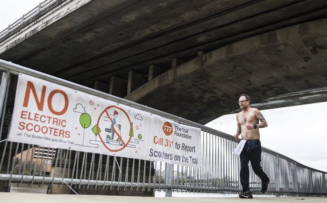

# Things that Austinite's Complain

### Background

In 2001, the City of Austin began using 311 service for Police non-emergency calls. This helped reduce the number of calls to 911, which later got expanded to include more city services.

Now its the single most point of contact for Citywide Services and Information hub. Since then Austinites have reported from port holes, to lost dog, traffic light issues, annoying neighbors, etc… The data set is rich in amount of information it carries, it has incident date time, department that belongs to, status update, and geolocation. With such details, the data gets refreshed every half-hour.

### :mag: Preliminary Findings

#### - City is plagued with animal problems, ranging from dead animals to loose dog, making Animal Services and Austin Resource recovery them the busiest department. 

#### - Not so surprisingly Potholes and Traffic light issues plague every city.

#### - Ten Most Busy Departments

Animal Services is indeed the most busiest followed by Code, and Transportation departments, while Austin Resource Recovery (ARR) is in charge of dead animal collection making it the fourth busiest.

#### - When do Austinites complain the most often?

Early Morning, and Late Afternoons

#### - How do the calls differ yearly and by month ?

##### While we are on it let's visualize calls yearly?

## Now onto the most interesting findings of all....

#### Love it or hate it here, you gotta admit they are at least fun to ride Weeeeee! Scotters 

Austin isn't the only city that is facing this mess, currently all metropolitan cities are facing this issue, with `Dockless Bike/Scotter` sharing the new vogue, it has literally exploded this recent past few years, with cities dealing with mess in cities like Dallas:

And signs prohibiting scooters on UT Austin's side walks, on Capitol Grounds, and city encouraging the reports of dockless rental scotters being used on trails where it's not allowed.

### See how the plague spreads from its inital launch in 2018

#### Let's freeze it...

### - Loud Noise Complaints

What about those frat parties you ask?

> Whatever the city is doing, it's helping reduce the loud music complaints over the years.

#### - Surprisingly, Parks and Rec has been doing damn good job in reducing complaints over the years.

