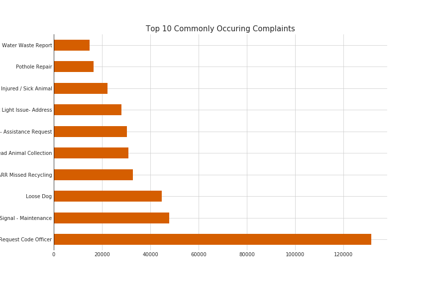

[](https://lbesson.mit-license.org/) [](https://mybinder.org/v2/gh/hurshd0/Austin-311-Data-Analysis/master)

# Exploratory Data Analysis of [City of Austin's 311 Calls](https://data.austintexas.gov/Utilities-and-City-Services/311-Unified-Data)
------
### Usage

- **Option 1:** Launch using the Binder icon
- **Option 2:** Create a new conda environment and activate it:
```linux
   conda env create -f environment.yml
   conda activate austin_eda
```

### Project Description

The aim of this EDA is to understand the City of Austin's 311 calls data from **2014 to 2019** and find any noticeable trends and answer the following types of questions:


- What are major complaints and concerns of Austinites?
- Which agency/department has the most complaint?
- Which method was frequently used to lodge complaints?
- Was city successful in reducing major complaints over the years?
- How has the major complaints changed over the years?
- How does the incident vary by year, month, day?
- Which zip codes have the most call incidents?
- Determining if there are any correlations between 311 complaints and socioeconomic factors?
- And any other interesting findings


### :pencil: TODO

- Phase 1: [X] Data Cleaning & Adding Socioeconomic features  
- Phase 2: [ ] Explorator Data Analysis & Explanatory Visualizations 
- Phase 3: [ ] Dashboard app 

### :mag: Preliminary Findings

- City is plagued with animal problems, ranging from dead animals to loose dog, making Animal Services and Austin Resource recovery them the busiest department. 

- Potholes and Traffic light issues plague every city.

<p align="center">

</p>

- The plague of Dockless mobility vehicle has taken over your city as well. 

<p align="center">

</p>

- Whatever the city is doing, it's helping reduce the loud music complaints over the years.

<p align="center">

</p>

- Surprisingly, Parks and Rec has been doing damn good job in reducing complaints over the years.

<p align="center">


</p>

### Dataset source

- [City of Austin's 311 calls data](https://data.austintexas.gov/)
- [U.S. Census geo-socioeconomic data](https://www.census.gov/programs-surveys/acs/)
